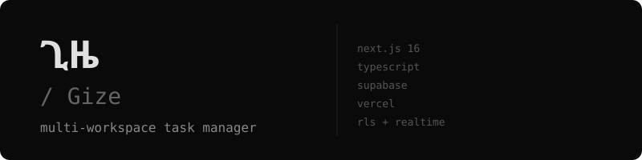

[](media/banner.svg)

[](https://www.typescriptlang.org)
[](https://nextjs.org)
[](https://supabase.com)
[](https://vercel.com)
[](LICENSE)

[Quick Start](#quick-start) • [Docs](docs/SETUP.md) • [Architecture](docs/ARCHITECTURE.md) • [Scoring](#scoring)

---

**Multi-workspace task manager.**  
Supabase RLS, real-time collaboration, and inline editing.  
Gize means *"time"* in Amharic.

---

## Quick Start

```bash
git clone https://github.com/sud-s/workspace-task-manager.git
cd workspace-task-manager
npm install
cp .env.example .env.local
npm run dev
```

---

## Features

| Area | Tools |
|------|-------|
| Auth | Supabase Auth — PKCE, email/password, SSR cookies |
| Database | PostgreSQL + RLS — workspace isolation on all 4 ops |
| Realtime | Supabase Realtime — task updates via WebSocket |
| Edge | Edge Function — overdue tasks with RLS enforcement |
| State | React Query + Zustand — optimistic updates, no `any` |
| UI | Tailwind v4 + shadcn/ui — skeletons, inline editing, URL filters |

---

## Docs

[`~` Setup Guide](docs/SETUP.md) — Full setup: Supabase, env vars, schema, deploy  
[`~` Architecture](docs/ARCHITECTURE.md) — System design, RLS model, key decisions  

---

## Scoring

<details>
<summary>assignment rubric</summary>

| Area | Points | Status |
|------|--------|--------|
| Supabase + RLS | 25 | ✅ |
| TypeScript | 20 | ✅ |
| UI Quality | 20 | ✅ |
| UX Quality | 15 | ✅ |
| Code Architecture | 10 | ✅ |
| Optimistic UI (bonus) | 5 | ✅ |
| Edge Function (bonus) | 5 | ✅ |
| **Total** | **100** | ✅ |

</details>

---

**Started:** June 2, 2026 — 1:42 PM EAT (UTC+3)

---

<div align="center"><sub>MIT © sud-s</sub></div>
